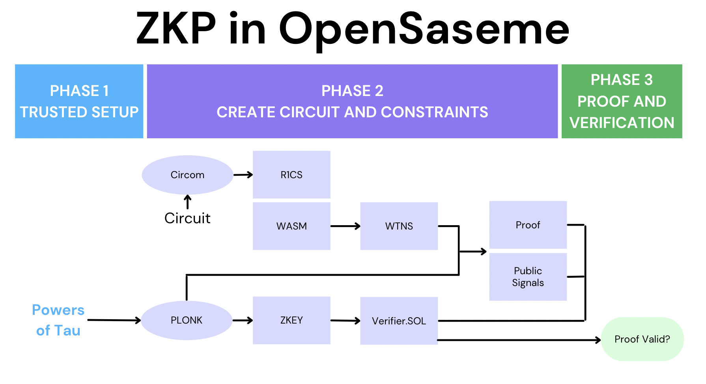

# Open Sesame

A ZK SNARK Puzzle Platform that unlocks certification NFTs via ENS

## Summary

This is a prototype game that allows one to certify credentials on chain using Zero Knowledge Proof SNARKs.

User Flow:
1. Proves you can solve a specific puzzle
2. Claim ENS subdomain NFT (held in trust until puzzle is completed)
3. Submit solution to on chain puzzle releasing NFT

The Zero Knowledge SNARKs allow us to decentralize the credentialing process. Users answer puzzles to gain credentials while not revealing the solutions to the rest of the chain.

In particular, the ENSTrust feature we develop in this project decouples the NFT which can be airdropped to people who already have EOA accounts. We believe this is going to make it much more appealing and easier for users to on ramp to Ethereum through credentialing systems

At it core, it has the following two main technologies:
- “ENSTrust” to which you can drop NFTs to an unclaimed ENS domain, EIP-5298 (draft)
- A puzzle with ZK-SNARKS to proof that you know the answer, using CIRCOM, zksnarkjs, Plonk

## Developer

### Tools

1. Hardhat to build solidity smart contract
2. Deployed verifier smart contract on Goerli (test net)
3. Django, NodeJS for backend serving which is currently being used to generate the proof

## zkSNARK Process

